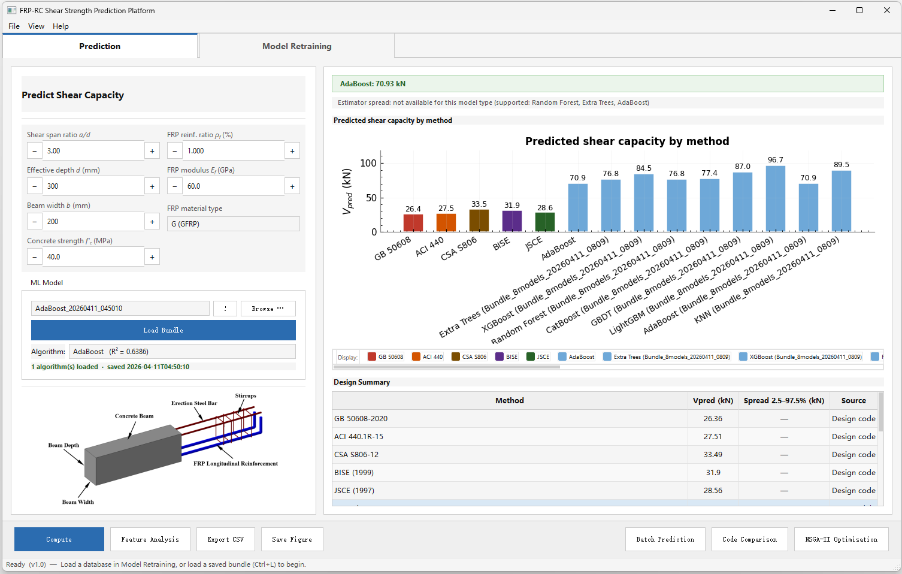
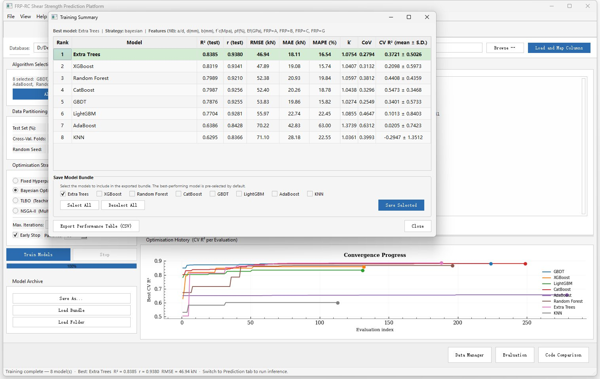
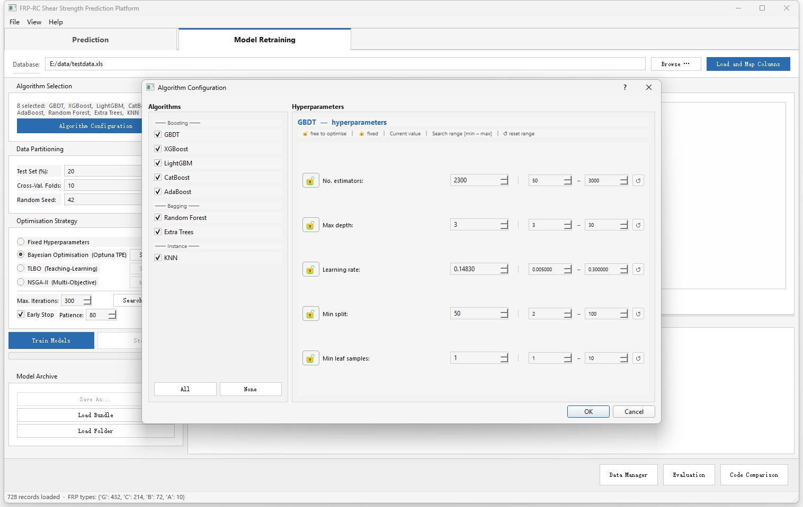
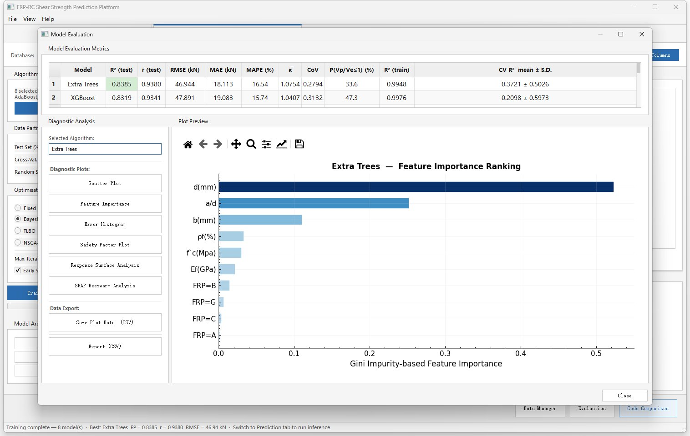

# FRP-ShearPred

**An open-source platform for shear capacity prediction of stirrup-free FRP-reinforced concrete beams integrating design codes and ensemble machine learning**

[](LICENSE)
[](https://www.python.org/)
[](https://github.com/hunter137/FRP-RC-Shear/actions/workflows/tests.yml)
[](https://doi.org/10.5281/zenodo.19503522)

---

## Overview

FRP-ShearPred is a cross-platform desktop application for shear strength assessment of fibre-reinforced polymer (FRP) reinforced concrete beams without shear reinforcement. It brings together five international design codes and eight ensemble machine learning algorithms in a single graphical environment, so that code predictions, ML predictions, and experimental data can all be compared without switching tools.

The software is aimed at structural engineers and researchers who work with FRP-RC experimental databases. A typical workflow is to load a dataset, train one or more ML models with Bayesian or evolutionary hyperparameter optimisation, inspect model behaviour through SHAP and partial dependence plots, and export results for reliability or statistical post-processing.

---

## Screenshots

**Prediction Tab** — enter beam parameters, load a trained model bundle, and
compare all design-code predictions against the ML model in a single view.



**Training Summary** — ranked performance table for all eight algorithms after
Bayesian optimisation, with live convergence curves.



**Algorithm Configuration** — per-algorithm hyperparameter editor with
lock/free toggles and user-defined search ranges for each optimisation strategy.



**Feature Importance** — Gini impurity-based ranking for the best model
(Extra Trees shown); all diagnostic plots are exportable as CSV or image files.



---

## Demo

The video below walks through a complete workflow — loading an experimental database, training models with Bayesian optimisation, running single and batch predictions, and exporting results.

<video src="docs/video.mp4" controls width="100%">
  <a href="docs/video.mp4">▶ Watch the demo video</a>
</video>

> **Tip:** If the video does not play inline, click [here](docs/video.mp4) to open it directly, or clone the repository and open `docs/video.mp4` locally.

---

## Features

- Five design codes side-by-side: GB 50608-2020, ACI 440.1R-15, CSA S806-12, BISE (1999), JSCE (1997)
- Eight ensemble ML algorithms: GBDT, XGBoost, LightGBM, CatBoost, Random Forest, Extra Trees, AdaBoost, KNN
- Three hyperparameter optimisation strategies: Bayesian search (Optuna TPE), TLBO, and NSGA-II multi-objective
- Model interpretability via SHAP beeswarm plots, Gini feature importance, and response surface analysis
- Batch prediction over entire CSV/Excel databases with one-click export
- Portable `.frpmdl` model bundles that carry the fitted model, scaler, encoder, and metadata in one file
- Interactive beam cross-section schematic with annotated parameter labels

---

## Installation

### Requirements

- Python 3.9 or later
- Operating system: Windows 10/11, macOS 12+, or Linux (Ubuntu 20.04+)

### Option 1 — conda (recommended)

```bash
git clone https://github.com/hunter137/FRP-RC-Shear.git
cd FRP-RC-Shear
conda env create -f environment.yml
conda activate frpshear
python main.py
```

### Option 2 — pip

```bash
git clone https://github.com/hunter137/FRP-RC-Shear.git
cd FRP-RC-Shear
pip install -r requirements.txt
python main.py
```

### Optional: CatBoost

CatBoost is excluded from the default install due to its large package size (~400 MB). Install separately if needed:

```bash
pip install catboost
```

---

## Usage

### Single Prediction

1. Open the **Prediction** tab.
2. Enter beam parameters (a/d, d, b, f′c, ρf, Ef, FRP type).
3. Load a pre-trained model bundle (`.frpmdl`) or train your own in the Training tab.
4. Click **Predict** to obtain results from all design codes and the loaded ML model simultaneously.
5. Click **Export CSV** to save results.

### Model Training

1. Open the **Model Retraining** tab.
2. Load an experimental database (`.xls`, `.xlsx`, or `.csv`).
3. Map columns to required features via the interactive column-mapping dialog.
4. Select algorithms and an optimisation strategy (Bayesian / TLBO / NSGA-II).
5. Click **Train**; live metrics and a progress bar are displayed throughout.

### Command-Line Training

```bash
# Train all models with Bayesian optimisation using the included example dataset
python train_frp_models.py --data data/testdata.xls

# Train specific models only
python train_frp_models.py --data data/testdata.xls --only LightGBM KNN

# Reduce trials for a faster exploratory run
python train_frp_models.py --data data/testdata.xls --trials 200

# Set a wall-clock time limit (minutes)
python train_frp_models.py --data data/testdata.xls --time-limit 60
```

### Batch Prediction

1. Click **Batch Prediction** in the Prediction tab.
2. Select an Excel/CSV file containing beam parameters in the required column format.
3. Results are computed for all design codes and the loaded ML model.
4. Export to CSV for downstream reliability or statistical analysis.

---

## Input Parameters

| Parameter | Symbol | Unit | Description |
|-----------|--------|------|-------------|
| Shear span ratio | a/d | — | Ratio of shear span to effective depth |
| Effective depth | d | mm | Distance from compression face to centroid of tensile reinforcement |
| Beam width | b | mm | Width of the rectangular cross-section |
| Concrete compressive strength | f′c | MPa | Cylinder compressive strength |
| FRP reinforcement ratio | ρf | % | Longitudinal FRP reinforcement ratio |
| FRP elastic modulus | Ef | GPa | Elastic modulus of FRP bars |
| FRP material type | — | — | CFRP, GFRP, BFRP, or AFRP |

---

## Design Codes Implemented

| Code | Region | Full Reference |
|------|--------|----------------|
| GB 50608-2020 | China | Technical Standard for Application of Fiber Reinforced Polymer (FRP) in Construction |
| ACI 440.1R-15 | USA | Guide for the Design and Construction of Structural Concrete Reinforced with FRP Bars |
| CSA S806-12 | Canada | Design and Construction of Building Structures with Fibre-Reinforced Polymers |
| BISE (1999) | UK | Interim Guidance on the Design of Reinforced Concrete Structures Using Fibre Composite Reinforcement |
| JSCE (1997) | Japan | Recommendation for Design and Construction of Concrete Structures Using Continuous Fibre Reinforcing Materials |

---

## Model Bundle Format

Trained models are saved as `.frpmdl` files (compressed joblib archives). Each bundle contains:

- Fitted model object(s)
- `MinMaxScaler` fitted on training data
- Feature column names and `OneHotEncoder` for categorical inputs
- Training/test metrics and cross-validation scores
- SHAP calibration subsample (up to 400 rows)
- Metadata: algorithm name, hyperparameters, training timestamp, software version

---

## Project Structure

```
FRP-RC-Shear/
├── main.py                  # Application entry point
├── app.py                   # MainWindow: assembles all tabs
├── train_frp_models.py      # Command-line training script
├── formulas.py              # Design code formula implementations
├── config.py                # Global constants and colour palette
├── column_mapping.py        # Database column auto-detection and mapping
├── metrics.py               # Regression evaluation metrics (R², RMSE, MAE, …)
├── model_io.py              # Model bundle save/load (.frpmdl)
├── optimization.py          # Hyperparameter search: TLBO, Bayesian, NSGA-II
├── qt_compat.py             # PyQt5/PySide6 compatibility shim
├── widgets.py               # Shared UI helper widgets
├── requirements.txt         # pip dependencies
├── environment.yml          # conda environment specification
├── LICENSE                  # MIT License
├── README.md                # This file
├── CITATION.cff             # Machine-readable citation metadata
├── CHANGELOG.md             # Version history
├── data/
│   └── testdata.xls         # Example experimental database (728 specimens)
├── models/                  # Pre-trained model bundles (.frpmdl)
├── docs/
│   ├── screenshots/         # Application screenshots
│   └── video.mp4            # Demo walkthrough video
├── tests/
│   ├── test_formulas.py     # Unit tests — design code formulas
│   └── test_metrics.py      # Unit tests — evaluation metrics
├── tools/
│   ├── diagnose_crash.py    # Crash diagnostics tool (run instead of main.py)
│   └── README.md            # Usage instructions for tools
└── tabs/
    ├── data_tab.py
    ├── train_tab.py
    ├── eval_tab.py
    ├── code_tab.py
    ├── predict_tab.py
    └── interp_tab.py
```

---

## Crash Diagnostics

If the application exits silently or crashes without a visible error message,
run the diagnostics tool instead of `main.py`:

```bash
python tools/diagnose_crash.py
```

This generates `crash_diag.log` in the project root.  Attach that file when
opening a bug report.  See [tools/README.md](tools/README.md) for the full list
of what the tool captures.

---

## Running Tests

```bash
python -m pytest tests/ -v
```

---

## Acknowledgments

This work was supported by the National Key R&D Program of China (Grant Nos. 2024YFC38098 and 2024YFC3809803), the Liaoning Xingliao Talents Program for Science and Technology Innovation Team (No. XLYC2404005), and the Technology Research and Development Program of Shenyang Science and Technology Bureau (Grant No. 24-213-3-33).

---

## Citation

If you use FRP-ShearPred in your research, please cite the following SoftwareX article (forthcoming):

```bibtex
@article{liang2026frpshearpred,
  author  = {Liang, Deyu and Cao, Jingwen and Liu, Jinlong and
             Cui, Yujun and Zhang, Yuzhuo and Xue, Xingwei and Xu, Lei},
  title   = {{FRP-ShearPred}: An open-source platform for shear capacity
             prediction of stirrup-free {FRP}-reinforced concrete beams
             integrating design codes and ensemble machine learning},
  journal = {SoftwareX},
  year    = {2026},
  doi     = {10.5281/zenodo.19503522},
}
```

---

## License

This project is licensed under the MIT License — see the [LICENSE](LICENSE) file for details.
